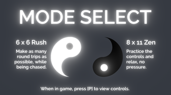
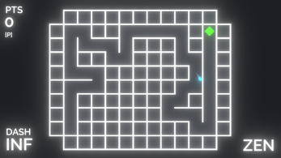
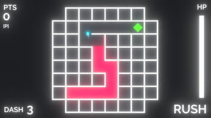

# Round Trip
 
Navigate randomly-generated mazes with only the ability to turn left!

Created for in 1 week during November 2021 for farsidevirtual's [One Minute Jam](https://itch.io/jam/one-minute-jam/entries).

[Play on itch.io](https://sappyjam.itch.io/round-trip)!

 

## Features
2 gameplay modes: RUSH, for a stressful race against time; and ZEN, for a more laid-back experience:
 

 

Random mazes, generated with a randomized depth-first search algorithm:
 

 

Try to complete as many round trips as possible before the RED catches up:
 

 

## Credits
"Explosion, 8-bit, 01.wav" by InspectorJ (www.jshaw.co.uk) of Freesound.org

"expressions of the mind (Piano loop)" by ShadyDave (soundcloud.com/lustersound) of Freesound.org

"Dramatic Music" by PureDesignGirl of Freesound.org

"Relaxing Short Music" by Theo Teravainen of Freesound.org